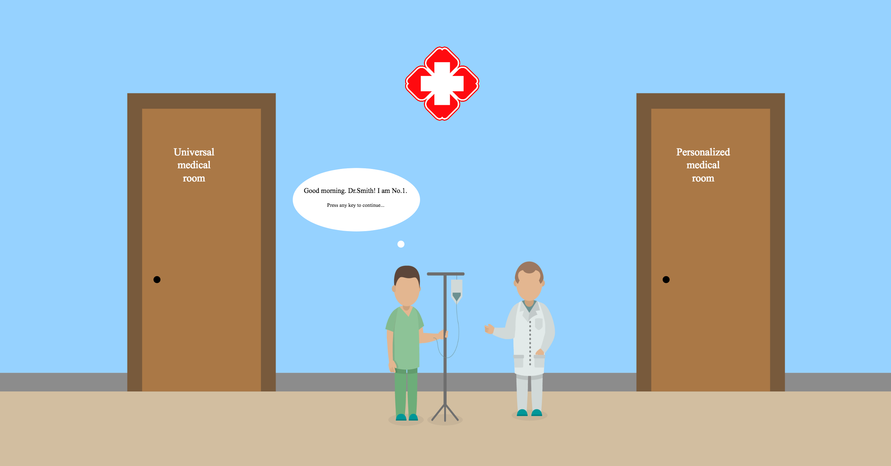

# Interactive p5 artwork
An interactive p5 artwork (JavaScript) - ANU@COMP1720 major project

This is an interactive p5 artwork for a new-media art installation. The goal is to provide an engaging user experience of roughly three minutes. 
Here’s the scenario: gallery attendees are able to walk around and observe the various works at their leisure. If they wish, they can pause at my sketch and interact with it, but they will receive no additional guidance/instruction on what to do.

### Theme ###

The theme is "Your Health in your Hands: Future Personalised Medical Technologies for a Sustainable and Effective Healthcare". It is based on the finalists for the [ANU Grand Challenge Scheme](https://www.anu.edu.au/news/all-news/vcs-update-anu-grand-challenges-scheme) -- a program designed to inspire the ANU to "look beyound the day to day address some of the biggest problems facing the world".

### Artist Statement ###
[Artist Statement](artist-statement.md)

### Interaction Statement ###
The [interaction statement](https://github.com/Chan-Xu/Interaction-Artwork/blob/master/interaction-statement.md) describes how a typical user will interact with my artwork.

## Demo video ##
[Youtube Video for Demo](https://www.youtube.com/watch?v=kgvFOwtwmBw&t=46s)

## Setup

1. install [Atom](https://atom.io/) (Windows, OSX or Linux)

2. install
   the
   [Git Plus](https://atom.io/packages/git-plus),
   [Live Server](https://atom.io/packages/atom-live-server)
   and [Color Picker](https://atom.io/packages/color-picker) packages (if you
   use the `apm` tool it's just `apm install git-plus atom-live-server color-picker`)

## Use

1. clone this repository somewhere

2. open the folder in Atom and start the atom live server (`Packages >
   atom-live-server > Start server` or `Ctrl+Alt+L`)

3. in Chrome, type `localhost:3000` into the address bar to run/view the sketch

4. every time you save the `sketch.js` file, the live server will auto-update
   the sketch in Chrome

## Resources

Here are a few places to find useful information:

- [p5.js reference](https://p5js.org/reference/)
- [course website](https://cs.anu.edu.au/courses/comp1720/)
